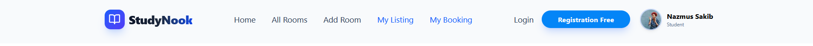
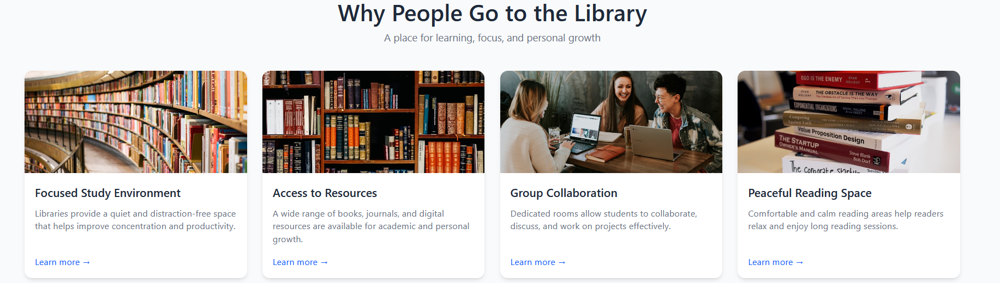
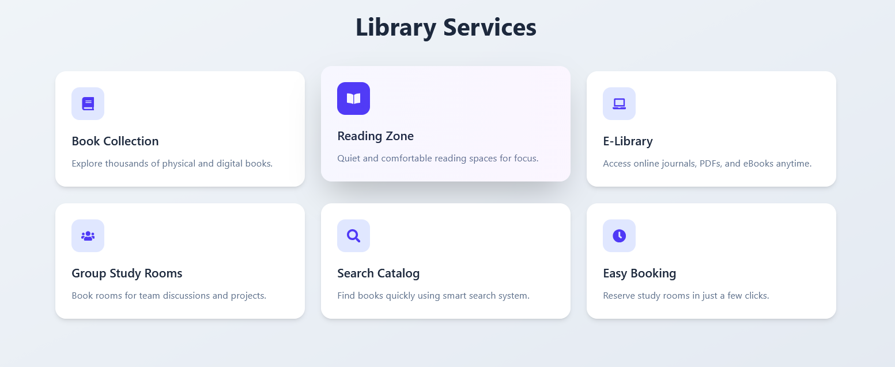
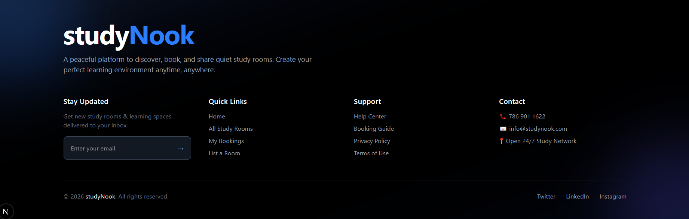
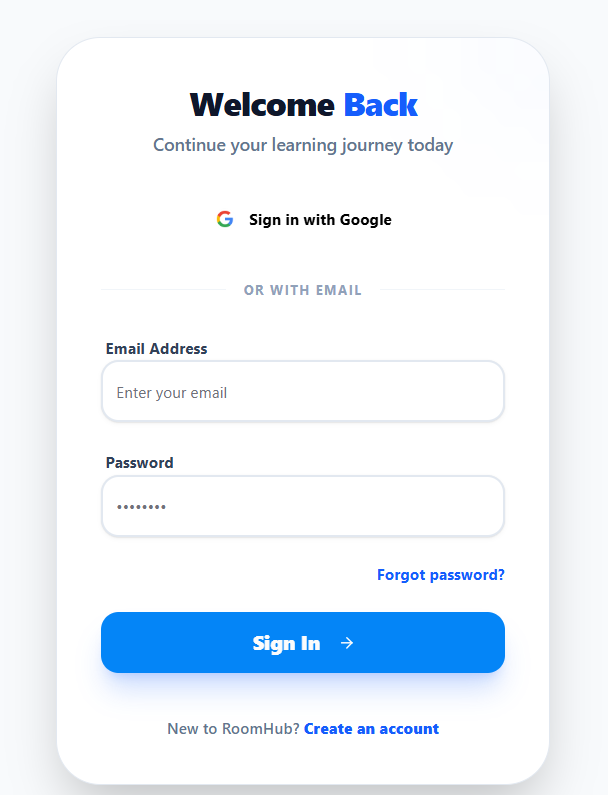
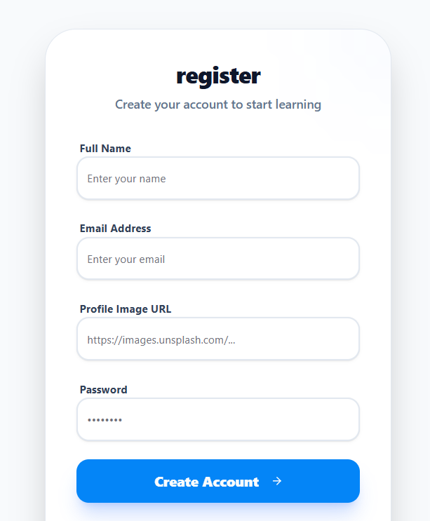
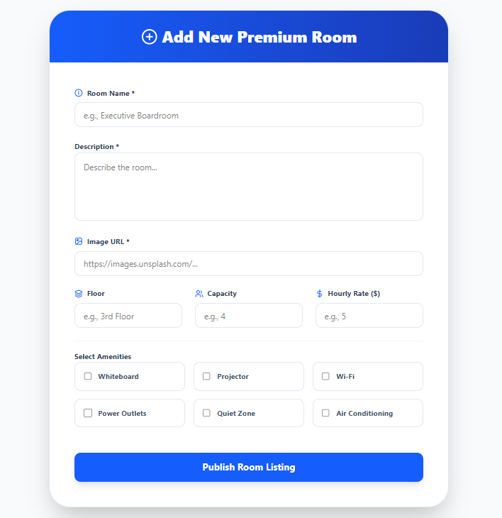
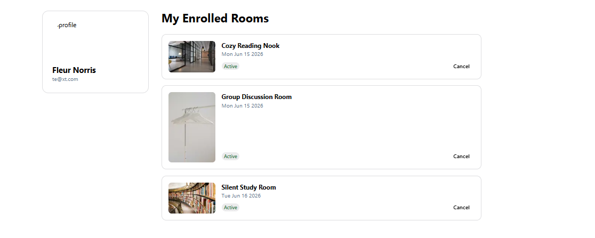
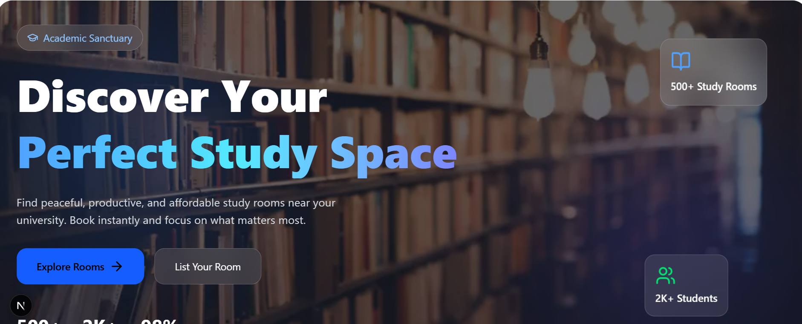

website link: https://study-phi-coral.vercel.app

StudyNook – Study Room Booking Platform

StudyNook is a full-stack web application that helps students and library users find, create, and book study rooms with ease. Users can browse available rooms, search and filter listings based on their needs, and reserve rooms for specific dates and time slots.

Key Features
🔍 Search & Filter Rooms – Quickly find study spaces using search and filtering options.
🏠 Create & Manage Rooms – Users who control study spaces can create new room listings and manage existing ones.
📅 Room Booking System – Book rooms for specific dates and time slots.
⚡ Conflict Detection – Automatically prevents double-booking by detecting overlapping reservations.
👤 User Dashboard – Manage personal bookings and room listings from a dedicated dashboard.
🔐 Secure Authentication – JWT-based authentication stored in HTTP-only cookies for enhanced security.
🚀 Google Sign-In – Users can easily register and log in using their Google account.
📱 Responsive Design – Fully responsive interface optimized for desktop, tablet, and mobile devices.
Project Goal

StudyNook streamlines the process of discovering and reserving study spaces, providing a secure, user-friendly, and efficient platform for both room owners and students.

Tech Stack: MongoDB, Express.js, React, Node.js, Next.js (MERN), JWT Authentication, Google OAuth, Tailwind CSS
<!-- navbar  -->

<!-- banner -->

<!-- extra two section  -->


<!-- footer section -->

<!-- login -->

<!-- register -->

<!-- addroom -->

<!-- cancel button -->

<!-- swipper  -->



This is a [Next.js](https://nextjs.org) project bootstrapped with [`create-next-app`](https://github.com/vercel/next.js/tree/canary/packages/create-next-app).

## Getting Started

First, run the development server:

```bash
npm run dev
# or
yarn dev
# or
pnpm dev
# or
bun dev
```

Open [http://localhost:3000](http://localhost:3000) with your browser to see the result.

You can start editing the page by modifying `app/page.js`. The page auto-updates as you edit the file.

This project uses [`next/font`](https://nextjs.org/docs/app/building-your-application/optimizing/fonts) to automatically optimize and load [Geist](https://vercel.com/font), a new font family for Vercel.

## Learn More

To learn more about Next.js, take a look at the following resources:

- [Next.js Documentation](https://nextjs.org/docs) - learn about Next.js features and API.
- [Learn Next.js](https://nextjs.org/learn) - an interactive Next.js tutorial.

You can check out [the Next.js GitHub repository](https://github.com/vercel/next.js) - your feedback and contributions are welcome!

## Deploy on Vercel

The easiest way to deploy your Next.js app is to use the [Vercel Platform](https://vercel.com/new?utm_medium=default-template&filter=next.js&utm_source=create-next-app&utm_campaign=create-next-app-readme) from the creators of Next.js.

Check out our [Next.js deployment documentation](https://nextjs.org/docs/app/building-your-application/deploying) for more details.
